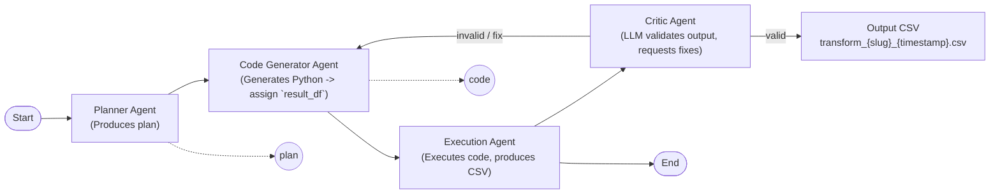

# Agentic Workflow — Transformation Pipeline

## Summary ✅
This document describes the agentic workflow implemented in `agentic_workflow_transformation.py`. It explains the components (Planner, Code Generator, Executor), how data flows through them, evaluation mode, filename conventions, and prompt best-practices to improve reliability.

---

## Architecture & Diagram 🔧


Mermaid diagram (copy into an editor that supports Mermaid to view):



ASCII fallback:

Start -> Planner -> Code Generator -> Executor -> Critic -> Output CSV
                         ^                                     |
                         |-------------------------------------|
                         | (on NO / fix request go back to Code Generator)

- Planner: produces `plan` text (the step-by-step transform plan)
- Code Generator: turns `plan` into Python code that must set `result_df`
- Executor: runs the code in a sandboxed local env and writes CSV

---

## Components & Responsibilities 🧩

- **Planner Agent** (`planner_agent`):
  - Input: `state['sample_data']`, `state['description']`
  - Output: `plan` (a step-by-step transformation)

- **Code Generator Agent** (`code_generator_agent`):
  - Input: `plan` and `sample_data`
  - Output: `code` (Python snippet; **must** create `result_df` and not write files)

- **Execution Agent** (`execution_agent`):
  - Executes generated code with `sample_data` and `pd` available
  - Extracts resulting DataFrame from `result_df` / `filtered_df` / `df` / `result`
  - Writes a unique CSV file: `transform_{slugified_description}_{UTC-timestamp}.csv`
  - Returns `output_path` in final state

 - **State Graph**: orchestrates nodes (`planner` -> `codegen` -> `executor` -> `critic`) and exposes `app.invoke(state)` to run flows. The critic may invoke the code generator again when fixes are requested by the LLM.

 - **Critic Agent** (`critic_agent`):
  - Input: `plan`, `code`, `sample_data`, produced `output`
  - Behavior: asks the LLM to judge correctness (YES/NO + reason). On NO it requests a corrected fenced Python snippet from the LLM and triggers a retry through the code generator and executor (limited retries).

---

## File & CLI usage 📁

- Run on default inline sample or load CSV:

```powershell
python .\agentic_workflow_transformation.py --input-csv path\to\input.csv
```

- Run evaluation suite (10 descriptions):

```powershell
python .\agentic_workflow_transformation.py --input-csv input.csv --eval
```

- Output files are saved to the project folder with names like:
  - `transform_filter_rows_where_age_30_and_select_name_20260106T145056313617.csv`

---

## Evaluation & Heuristics 🧪

- The `--eval` run executes a set of sample `description`s and validates outputs using the **LLM-based critic** (see below). The previous heuristic-based `compute_expected_df` has been replaced by a critic that asks the LLM whether the generated output implements the plan.
- Comparison is tolerant for evaluation reporting: tools may compare row counts and inspect example rows, but correctness is decided by the critic's YES/NO judgement (with a short reason on NO).
- If a transformation yields zero rows, the executor still writes a header-only CSV and the critic can confirm whether an empty result is correct for the plan.

---

## Prompting guidance (make generation reliable) ✍️

Use these rules when updating the generator prompt:

1. **Force exact predicates**: ask the LLM to use the numeric operators and values from the description **verbatim** (e.g., `age > 100`).
2. **Require `result_df`**: final output must be assigned to `result_df` as a pandas DataFrame.
3. **Return code only**: reply with a single fenced Python block and no explanatory text.
4. **Forbid file writes**: do not call `.to_csv()` inside generated code; the runner handles saving.
5. **Add assertions**: ask the model to include final checks like `assert result_df.empty or (result_df['age'].min() > 100)` to catch inverted operators.
6. **Edge-case examples**: include a small few-shot example for edge conditions (e.g., `age > 100` should produce an empty CSV).

Suggested prompt snippet to use in `code_generator_agent` is included in the source code comments.

---

## Troubleshooting & Tips ⚠️

- If outputs have extra columns or ordered differently, adjust model prompt to “select exactly the requested columns in the requested order.”
- If the model produces explanations or non-code text, update the prompt to require a single fenced code block only.
- If the model uses inline sample data, the executor sanitizes it by replacing `data = [...]` blocks with `sample_data` — however, better to instruct the model not to create inline data.

---

## LLM-based Critic (new) 🤖

- The critic is now LLM-based: after execution, the critic asks the LLM to decide — given the PLAN, the generated code, the input sample (first few rows) and the produced output (first few rows) — whether the output implements the PLAN.
- Validation prompt: the critic asks for ONLY 'YES' or 'NO' on the first line; if NO the model is asked to provide a one-line reason on the second line.
- If the critic answers NO, it will request a corrected fenced Python snippet from the LLM that implements the PLAN exactly (the request includes the previous code and examples of input/output). The executor runs the corrected code and the critic re-validates. This repeats up to a small retry limit (default 2 attempts).
- To avoid unrelated fallbacks (e.g., the model defaulting to a common filter like `age > 30`), the code generator prompt now **includes the PLAN** and, on retries, the **previous code** so fixes are targeted to the failure reason.

Example critic prompt (conceptual):
```
Plan: {plan}

Transformation Description: {description}

Generated Code:
{code}

Input Data (first 5 rows):
{sample_head}

Output Data (first 5 rows):
{output_head}

Question: Does the output correctly implement the transformation described in the plan? Answer with ONLY 'YES' or 'NO' on the first line; if NO provide a one-sentence reason on the second line.
```

And when requesting a fix:
```
Please provide a corrected Python code snippet (fenced in ```python) that implements the PLAN exactly. Return only the fenced code block, ensure the final DataFrame is assigned to `result_df`, and avoid adding or changing sample data literals.
```

---

## Troubleshooting & Notes ⚠️

- If the critic repeatedly triggers retries and the model returns unrelated fixes (for example defaulting to an unrelated filter like `age > 30`), ensure the code generator prompt includes the **full PLAN** and instructs the model to use **exact predicates** and to return a **fenced Python block only**. Also include the previous code in the retry prompt so the model patches the correct area rather than starting over.
- If the LLM is unavailable in your environment, the critic will log a warning and accept outputs (useful for offline/deterministic CI runs). For best results, run evaluation with a configured LLM provider.

---

## Where to look in codebase 🔎

- Main pipeline: `agentic_workflow_transformation.py`
- Example input CSV: `input.csv`
- Evaluation output: `eval_results.csv`
- Transform output files: `transform_*.csv`

---

If you want, I can:
- Add the Mermaid diagram to the repo's README or generate a PNG of it, or
- Update the prompt in the code to include the stronger assertions and re-run the evaluation now.

Pick which change you want next and I'll proceed. ✅
